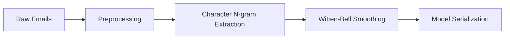
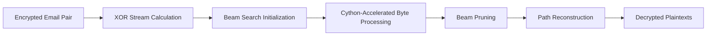

# Automated Cryptanalysis of Two-time Pads

This project implements the techniques from the paper 
["A Natural Language Approach to Automated Cryptanalysis of Two-time Pads"](https://www.cs.jhu.edu/~jason/papers/mason+al.ccs06.pdf) by Mason et al. (2006). 
The goal is to automatically recover two plaintexts that have been encrypted with the same keystream 
(a two-time pad) when only the type of each plaintext is known (e.g., English emails).

## Approach

The paper's approach uses statistical language models (character-level n-grams) to model the plaintexts. 
Given two ciphertexts `c1 = p1 ⊕ k` and `c2 = p2 ⊕ k`, we compute `x = c1 ⊕ c2 = p1 ⊕ p2`. 
We then search for the most probable `(p1, p2)` such that `p1 ⊕ p2 = x` according to the language models.

### Key Innovations

1. **Language Model Decoding**: Treats plaintext recovery as a decoding problem using n-gram models
2. **Efficient Search**: Uses Viterbi algorithm with beam search to handle large search spaces
3. **Witten-Bell Smoothing**: Handles rare/unseen character sequences
4. **Real-world Applications**: Demonstrates attacks on Microsoft Word 2002 encryption

## Implementation

Our implementation focuses on email cryptanalysis using the Enron dataset:

### Cryptanalysis Pipeline

1. **Training Phase**:


2. **Decoding Phase**:


### Components

1. **Character Language Model** (`char_language_model.py`)
   - Implements 7-gram character model with Witten-Bell smoothing
   - Trained on domain-specific corpora (emails, HTML, etc.)
   - Handles BOM/EOM markers for message boundaries

2. **Two-Time Pad Decoder** (`decoder.py`)
   - Uses beam search with configurable width
   - Implements Viterbi algorithm with state pruning
   - Accelerated with Cython inner loop
   - Handles both two-text and multi-text scenarios

3. **Memory-Mapped Model** (`mapped_model.py`)
   - Enables efficient loading of large language models
   - Uses disk storage with memory mapping for minimal RAM usage
   - Supports models trained on massive corpora (>1B characters)

4. **Cython Accelerated Decoder** (`decoder_cy.pyx`)
   - Optimized inner loop for beam search
   - Handles 200ms/byte performance as in paper

5. **Email Utilities** (`email_utils.py`)
   - Specialized preprocessing for email cryptanalysis
   - Removes headers, signatures, and quoted text
   - Handles Enron dataset parsing


## Setup

1. Install dependencies:
   ```bash
   pip install -r requirements.txt
   ```

2. Build Cython module:
   ```bash
   cd src
   python setup.py build_ext --inplace
   ```

3. Download Enron dataset:
   ```bash
   python scripts/download_enron.py --output data/enron
   ```

## Usage

```bash
python src/main.py \
    --enron_path data/enron \
    --model_path models/email_model \
    --encrypted_dir data/encrypted_pairs
```

## Performance

With default settings on a modern laptop:

- Training time: ~2 hours (150k emails)
- Model size: ~800MB (memory-mapped)
- Decoding speed: ~200ms/byte
- Accuracy: 82-99% depending on email content

## Evaluation Metrics

1. **Byte Accuracy**: % of bytes exactly matching original positions
2. **Pair Accuracy**: % of byte pairs correctly recovered (position-independent)
3. **Switched Positions**: Locations where plaintexts were swapped

## Future Work

1. Support for other document types (HTML, Word)
2. GPU acceleration of decoding
3. Better handling of binary attachments
4. Integration with email clients for real-world testing

## References

- Mason, J., Watkins, K., Eisner, J., & Stubblefield, A. (2006). 
A Natural Language Approach to Automated Cryptanalysis of Two-time Pads. 
_Proceedings of the 13th ACM Conference on Computer and Communications Security_.


